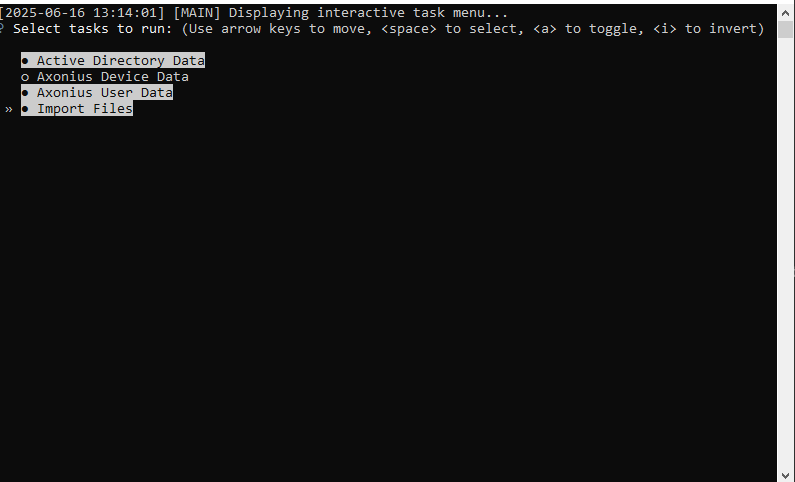

# Network Asset Mapper

## What's This?

This tool is a Python-based framework designed to pull device and user data from multiple sources, consolidate it all, and generate a detailed Excel report. It connects to the Axonius API, pulls user data from Active Directory, and can import local CSV/Excel files to create a single, comprehensive view of your network assets.



---

## Features

* **Modular Tasks:** Use an interactive menu to choose exactly which data sources you want to pull from in each run.
* **Prerequisite Checker:** A built-in script automatically checks for and installs any missing Python libraries.
* **Multi-Source Pull:**
    * **Axonius:** Fetches device and user data via its API.
    * **Active Directory:** Launches a PowerShell script to securely pull user details.
    * **Local Files:** Imports any `.csv` or `.xlsx` files placed in the `Import` folder.
* **Data Consolidation:** Intelligently merges all the data, enriches it with user and department info, and removes duplicates.
* **Automated Reporting:** Generates a multi-tabbed Excel spreadsheet with:
    * A consolidated list of all devices.
    * A pivot table showing department vs. subnet IP counts.
    * A reverse-lookup sheet to see all assets tied to a user.
    * Raw data from every source for easy validation.

---

## Project Structure

The project is organized into several folders to keep things tidy:
```
.
├── launch.py               # <-- The main script you run.
├── config.template.json    # <-- Your configuration template.
├── Scripts/
│   ├── main.py             # The core data processing logic.
│   ├── check.py            # Checks for and installs Python libraries.
│   ├── api.py              # Handles all API connections.
│   └── ad.ps1              # PowerShell script for the AD pull.
├── Import/                   # Drop your local CSV or Excel files here.
├── Output/                   # Your final Excel reports appear here.
└── Logs/                     # Stores detailed activity and error logs.
```
---

## How to Get Started

### 1. Requirements

* Python 3.x
* PowerShell (for the Active Directory task on Windows)

### 2. Setup & Installation

This project is designed for a super easy setup.

1.  **Clone or Download:** Get the project files onto your machine.
2.  **Configure the Tool (Most Important Step!):**
    * Find the `config.template.json` file.
    * **Make a copy of it** and rename the copy to `config.json`.
    * Open `config.json` and replace all the placeholder values (like `"YOUR_API_KEY"`, etc.) with your actual environment details. The script will not work without this.
3.  **Run the Launcher:**
    * That's it! Just run the main launcher script.
    ```bash
    python launch.py
    ```
    * The very first time you run it, the prerequisite checker (`check.py`) will open in a new window and automatically install all the Python libraries you need. Just let it finish and press Enter in that window when it's done.

---

## How to Use It

1.  Double-click or run `python launch.py` from your terminal.
2.  An interactive menu will pop up. Use the arrow keys and spacebar to select which tasks you want to run.
3.  Hit Enter.
4.  The script will now run each task you selected. If you chose the Active Directory pull, a PowerShell window will appear asking for your credentials (this keeps them secure and out of the code).
5.  Once everything is finished, you'll find your final, consolidated Excel report in the `Output/` folder.

---

## License

This project is licensed under the **GNU General Public License v3.0**.
